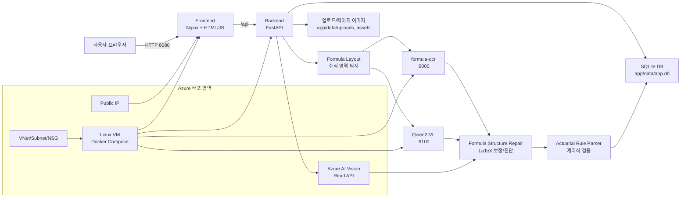
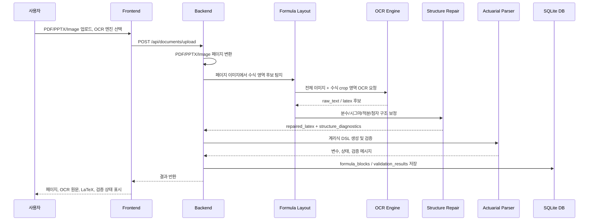

# Azure OCR Formula Qwen AI

보험계리 수식이 포함된 PDF/PPTX/이미지를 업로드하고, 여러 OCR 엔진의 인식 결과를 비교하는 PoC입니다. 로컬 Docker Compose 앱과 Azure 배포용 Terraform을 하나의 저장소 안에 함께 관리합니다.

이번 개조의 핵심은 **문자 OCR**이 아니라 **수식 구조 복원 OCR**입니다. 즉, `시그마`, `적분`, `분수`, `위첨자`, `아래첨자`, `루트`, `계리기호`를 단순 문자 나열이 아니라 LaTeX 구조로 복원하는 파이프라인을 추가했습니다.

---

## 저장소 구조

```text
.
├── app/                         # 실제 OCR 웹 애플리케이션 및 Docker Compose 소스
│   ├── backend/                  # FastAPI, OCR 라우팅, SQLite 저장, Rule Parser
│   │   └── app/
│   │       ├── formula_ocr.py        # OCR 엔진 어댑터
│   │       ├── formula_layout.py     # 수식 영역 탐지 + region OCR
│   │       ├── formula_structure.py  # LaTeX 구조 보정/진단
│   │       ├── formula_parser.py     # 계리식 Rule Parser
│   │       └── ppt_processor.py      # PDF/PPTX/Image 처리 파이프라인
│   ├── frontend/                 # Nginx + HTML/JS 화면
│   ├── formula-ocr/              # 수식 OCR API 컨테이너
│   ├── qwen-vl/                  # Qwen2-VL API 컨테이너
│   ├── docker-compose.yml
│   └── manual-start.sh
└── terraform/                    # Azure VM, 네트워크, Azure AI Vision 생성 코드
    ├── main.tf
    ├── variables.tf
    ├── outputs.tf
    ├── versions.tf
    ├── cloud-init.yaml.tftpl
    └── terraform.tfvars.example
```

---

## 전체 구성도



---

## 개선된 OCR 처리 흐름

기존에는 OCR 엔진이 반환한 문자열을 그대로 후처리했습니다. 이 방식은 문자 인식은 되지만, 수식의 2차원 구조를 복원하지 못했습니다.

개선 후 흐름:



---

## 왜 기존 OCR이 계리식을 완성하지 못했는가?

일반 OCR은 대개 다음을 수행합니다.

```text
이미지 → 문자 검출 → 문자 인식 → 줄 단위 텍스트 출력
```

하지만 계리식은 단순 줄 텍스트가 아닙니다.

```text
분자/분모
위첨자/아래첨자
시그마의 상한/하한
적분의 구간
루트 범위
괄호 범위
다중 행 수식
계리기호 l_x, q_x, v^t, D_x, N_x, E_{ANC}(t,x)
```

예를 들어 OCR이 아래처럼 문자를 읽어도:

```text
Σ
k=0
n
v^k
p_x
```

수식 구조로는 아래처럼 복원해야 합니다.

```latex
\sum_{k=0}^{n} v^k p_x
```

따라서 이 저장소는 문자 OCR 결과에 다음 단계를 추가합니다.

```text
수식 영역 탐지
  ↓
구조 중심 LaTeX OCR Prompt
  ↓
LaTeX 구조 보정
  ↓
계리식 Rule Parser 검증
```

---

## 새로 추가된 핵심 파일

| 파일 | 역할 |
|---|---|
| `app/backend/app/formula_layout.py` | 페이지 이미지에서 수식 후보 영역을 탐지하고, 전체 이미지 + crop OCR을 수행 |
| `app/backend/app/formula_structure.py` | `\sum`, `\int`, `\frac`, `_`, `^` 등 구조 보정 및 진단 |
| `app/backend/app/formula_ocr.py` | Qwen 등 Vision LLM에 구조화 LaTeX 프롬프트 전달 지원 |
| `app/qwen-vl/app.py` | 기본 프롬프트를 일반 OCR이 아닌 수식 LaTeX 복원용으로 변경 |
| `app/backend/app/ppt_processor.py` | PDF/PPTX/Image 처리 시 structured region OCR 적용 |

---

## OCR 엔진

| 엔진 | 설명 | 한계 |
|---|---|---|
| `formula-ocr` | 수식 전용 로컬 OCR 컨테이너 | 복잡한 계리 첨자/시그마에서 오류 가능 |
| `Qwen2-VL` | Vision LLM 컨테이너, 구조화 LaTeX 프롬프트 적용 | 2B 모델은 복잡한 수식에서 여전히 오인식 가능, CPU에서 느림 |
| `Azure AI` | Azure AI Vision Read API | 일반 문서 OCR 중심이라 LaTeX 수식 복원에는 약함 |
| `formula_layout.py` | 수식 영역 crop 후보 생성 | 무거운 CV 모델이 아니라 row-density 기반 휴리스틱 |
| `formula_structure.py` | LaTeX 구조 보정/진단 | 완전한 수식 인식 모델은 아니며 후처리 보정 계층 |
| Python Rule Parser | OCR 결과를 계리식 패턴으로 후처리 | OCR 원문이 심하게 깨지면 복원 한계 |

---

## 로컬/서버 Docker 실행

```bash
cd /home/son/azure_OCR_Formual_Qwen_AI/app

docker compose build
./manual-start.sh base
```

Qwen까지 실행:

```bash
./manual-start.sh qwen
```

상태 확인:

```bash
./manual-start.sh status
docker compose ps
docker compose logs -f backend
docker compose logs -f qwen-vl
```

접속:

```text
http://<server-ip>:8080/
```

---

## 권장 테스트 방법

### 1. Qwen 구조 OCR 사용

브라우저에서 OCR 엔진을 `qwen` 또는 `qwen-vl`로 선택합니다.

또는 API 직접 호출:

```bash
curl -F "file=@sample_formula.png" \
     -F "ocr_engine=qwen" \
     http://localhost:8000/documents/upload
```

### 2. 결과 확인

```bash
curl http://localhost:8000/documents
curl http://localhost:8000/documents/<document_id>
curl http://localhost:8000/documents/<document_id>/pages/1
```

### 3. 수식 재검증

```bash
curl -X POST http://localhost:8000/documents/<document_id>/revalidate-formulas
```

### 4. 기존 OCR 결과 재그룹핑

```bash
curl -X POST http://localhost:8000/documents/<document_id>/regroup-formulas
```

---

## 구조 진단 정보

새 파이프라인은 `formula_dsl_json`에 구조 진단 정보를 저장합니다.

예:

```json
{
  "structure_diagnostics": {
    "quality_score": 18.5,
    "warnings": ["sum_without_complete_bounds"],
    "has_fraction": true,
    "has_sum": true,
    "has_integral": false,
    "has_subscript": true,
    "has_superscript": true
  }
}
```

`warnings`가 있으면 `formula_blocks.status`가 `NEEDS_REVIEW`로 남습니다.

---

## Azure 배포

```bash
cd /home/son/azure_OCR_Formual_Qwen_AI/terraform

az login
az account set --subscription "<subscription-id>"

cp terraform.tfvars.example terraform.tfvars
vi terraform.tfvars
```

`terraform.tfvars` 예:

```hcl
subscription_id = "00000000-0000-0000-0000-000000000000"
location        = "koreacentral"
name_prefix     = "actocr"

allowed_ssh_cidr = "0.0.0.0/0"
allowed_app_cidr = "0.0.0.0/0"

vm_size          = "Standard_D8s_v5"
os_disk_size_gb  = 128
source_app_path  = "../app"
deploy_app       = true
start_qwen       = false
```

배포:

```bash
terraform init
terraform validate
terraform plan
terraform apply
```

접속 정보:

```bash
terraform output app_url
terraform output backend_url
terraform output ssh_command
```

---

## Azure 리소스

| 구분 | 내용 |
|---|---|
| Resource Group | `actocr-<suffix>-rg` |
| VM | Ubuntu 22.04, Docker Compose 설치 |
| Public IP | Frontend 8080, Backend 8000, SSH 22 |
| VNet/Subnet/NSG | 기본 네트워크 및 인바운드 제어 |
| Azure AI Vision | `ComputerVision` 계정, Azure OCR 비교용 |

---

## 삭제

```bash
cd /home/son/azure_OCR_Formual_Qwen_AI/terraform
terraform destroy
```

자동 승인:

```bash
terraform destroy -auto-approve
```

---

## 커밋 금지 파일

아래 파일/디렉터리는 GitHub에 올리지 않습니다.

- `app/data/`
- `app/formula-ocr-models/`
- `app/qwen-vl-models/`
- `terraform/.terraform/`
- `terraform/terraform.tfvars`
- `terraform/*.tfstate`
- `terraform/*.tfstate.backup`
- `terraform/generated-ssh.pem`
- `*.pem`
- `.env*`

---

## 문제 해결

### 502 Bad Gateway

```bash
cd /home/son/azure_OCR_Formual_Qwen_AI/app
docker compose ps
curl http://localhost:8000/health
docker compose logs -f backend
./manual-start.sh restart-backend
```

### Qwen OOM

`qwen-vl`이 `Exited (137)`이면 메모리 부족 가능성이 큽니다. `start_qwen = false`로 배포한 뒤 필요할 때 수동 실행하거나 더 큰 VM을 사용합니다.

### 수식이 여전히 줄 단위로 잘리는 경우

```bash
curl -X POST http://localhost:8000/documents/<document_id>/regroup-formulas
curl -X POST http://localhost:8000/documents/<document_id>/revalidate-formulas
```

그래도 안 되면 `ocr_engine=qwen`으로 다시 업로드하고, 수식이 포함된 영역을 더 크게 crop한 이미지로 테스트합니다.

### Azure VM Quota

`Standard_D8s_v5` quota가 없으면 `terraform.tfvars`에서 사용 가능한 SKU로 바꾸거나 Azure Portal에서 quota 증설을 요청합니다.
