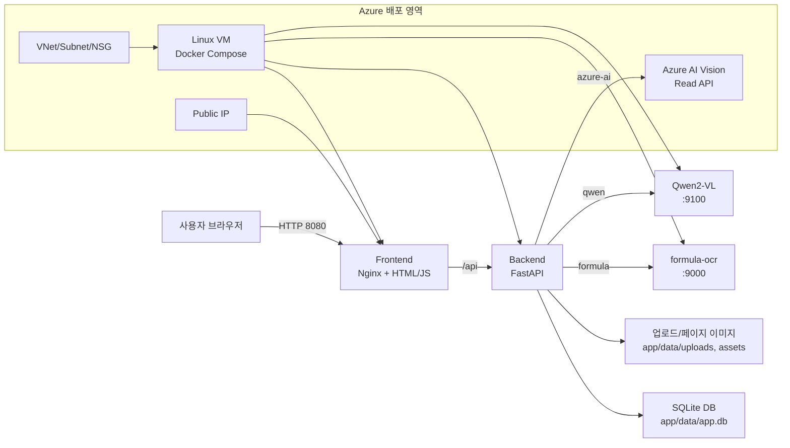
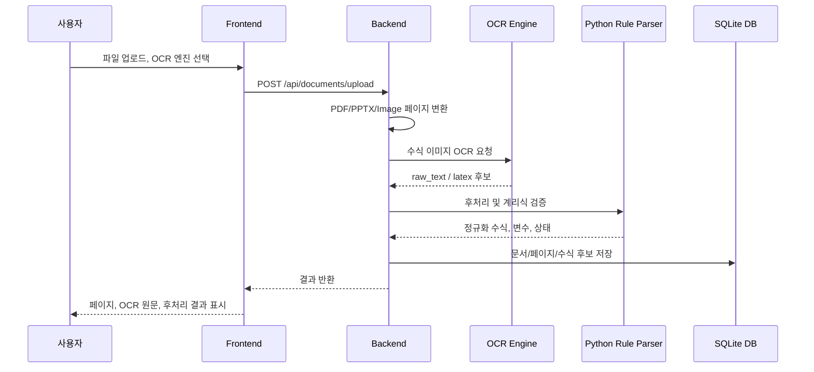

# Azure OCR Formula Qwen AI

보험계리 수식이 포함된 PDF/PPTX/이미지를 업로드하고, 여러 OCR 엔진의 인식 결과를 비교하는 PoC입니다. 로컬 Docker Compose 앱과 Azure 배포용 Terraform을 하나의 저장소 안에 함께 관리합니다.

## 저장소 구조

```text
.
├── app/                 # 실제 OCR 웹 애플리케이션 및 Docker Compose 소스
│   ├── backend/          # FastAPI, OCR 라우팅, SQLite 저장, Rule Parser
│   ├── frontend/         # Nginx + HTML/JS 화면
│   ├── formula-ocr/      # 수식 OCR API 컨테이너
│   ├── qwen-vl/          # Qwen2-VL API 컨테이너
│   ├── docker-compose.yml
│   └── manual-start.sh
└── terraform/           # Azure VM, 네트워크, Azure AI Vision 생성 코드
    ├── main.tf
    ├── variables.tf
    ├── outputs.tf
    ├── versions.tf
    ├── cloud-init.yaml.tftpl
    └── terraform.tfvars.example
```

GitHub에는 이 루트 디렉터리 전체를 올리면 됩니다.

```bash
cd /home/son/azure_OCR_Formual_Qwen_AI
```

## 전체 구성도



## OCR 처리 흐름



## OCR 엔진

| 엔진 | 설명 | 한계 |
|---|---|---|
| `formula-ocr` | 수식 전용 로컬 OCR 컨테이너 | 복잡한 계리 첨자/시그마에서 오류 가능 |
| `Qwen2-VL` | 경량 Vision LLM 컨테이너 | 2B 모델은 ChatGPT high 수준보다 낮고 CPU에서 느림 |
| `Azure AI` | Azure AI Vision Read API | 일반 문서 OCR 중심이라 LaTeX 수식 복원에는 약함 |
| Python Rule Parser | OCR 결과를 계리식 패턴으로 후처리 | OCR 원문이 심하게 깨지면 복원 한계 |

## 로컬/서버 Docker 실행

```bash
cd /home/son/azure_OCR_Formual_Qwen_AI/app

docker compose build
./manual-start.sh base
```

Qwen까지 실행:

```bash
./manual-start.sh qwen
```

상태 확인:

```bash
./manual-start.sh status
docker compose ps
docker compose logs -f backend
```

접속:

```text
http://<server-ip>:8080/
```

## Azure 배포

```bash
cd /home/son/azure_OCR_Formual_Qwen_AI/terraform

az login
az account set --subscription "<subscription-id>"

cp terraform.tfvars.example terraform.tfvars
vi terraform.tfvars
```

`terraform.tfvars` 예:

```hcl
subscription_id = "00000000-0000-0000-0000-000000000000"
location        = "koreacentral"
name_prefix     = "actocr"

allowed_ssh_cidr = "0.0.0.0/0"
allowed_app_cidr = "0.0.0.0/0"

vm_size          = "Standard_D8s_v5"
os_disk_size_gb  = 128
source_app_path  = "../app"
deploy_app       = true
start_qwen       = false
```

배포:

```bash
terraform init
terraform validate
terraform plan
terraform apply
```

접속 정보:

```bash
terraform output app_url
terraform output backend_url
terraform output ssh_command
```

## Azure 리소스

| 구분 | 내용 |
|---|---|
| Resource Group | `actocr-<suffix>-rg` |
| VM | Ubuntu 22.04, Docker Compose 설치 |
| Public IP | Frontend 8080, Backend 8000, SSH 22 |
| VNet/Subnet/NSG | 기본 네트워크 및 인바운드 제어 |
| Azure AI Vision | `ComputerVision` 계정, Azure OCR 비교용 |

## 삭제

```bash
cd /home/son/azure_OCR_Formual_Qwen_AI/terraform
terraform destroy
```

자동 승인:

```bash
terraform destroy -auto-approve
```

## GitHub 업로드

```bash
cd /home/son/azure_OCR_Formual_Qwen_AI

git init
git remote add origin https://github.com/sonmap/azure_OCR_Formual_Qwen_AI.git
git add .
git status
git commit -m "Add Azure OCR Formula Qwen AI"
git branch -M main
git push -u origin main
```

이미 remote가 있으면:

```bash
git remote set-url origin https://github.com/sonmap/azure_OCR_Formual_Qwen_AI.git
git add .
git commit -m "Update Azure OCR Formula Qwen AI"
git push
```

## 커밋 금지 파일

아래 파일/디렉터리는 GitHub에 올리지 않습니다.

- `app/data/`
- `app/formula-ocr-models/`
- `app/qwen-vl-models/`
- `terraform/.terraform/`
- `terraform/terraform.tfvars`
- `terraform/*.tfstate`
- `terraform/*.tfstate.backup`
- `terraform/generated-ssh.pem`
- `*.pem`
- `.env*`

## 문제 해결

### 502 Bad Gateway

```bash
cd /home/son/azure_OCR_Formual_Qwen_AI/app
docker compose ps
curl http://localhost:8000/health
docker compose logs -f backend
./manual-start.sh restart-backend
```

### Qwen OOM

`qwen-vl`이 `Exited (137)`이면 메모리 부족 가능성이 큽니다. `start_qwen = false`로 배포한 뒤 필요할 때 수동 실행하거나 더 큰 VM을 사용합니다.

### Azure VM Quota

`Standard_D8s_v5` quota가 없으면 `terraform.tfvars`에서 사용 가능한 SKU로 바꾸거나 Azure Portal에서 quota 증설을 요청합니다.
